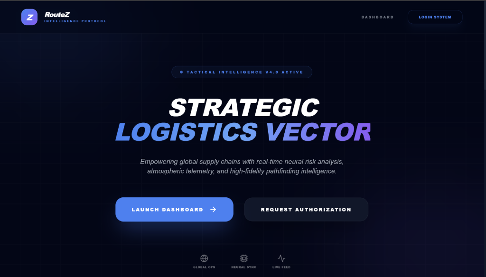
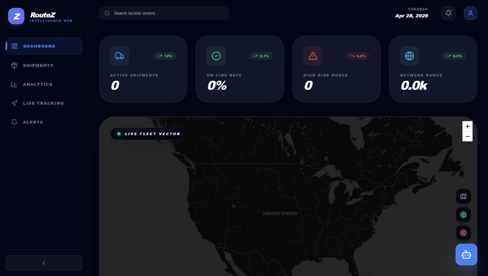
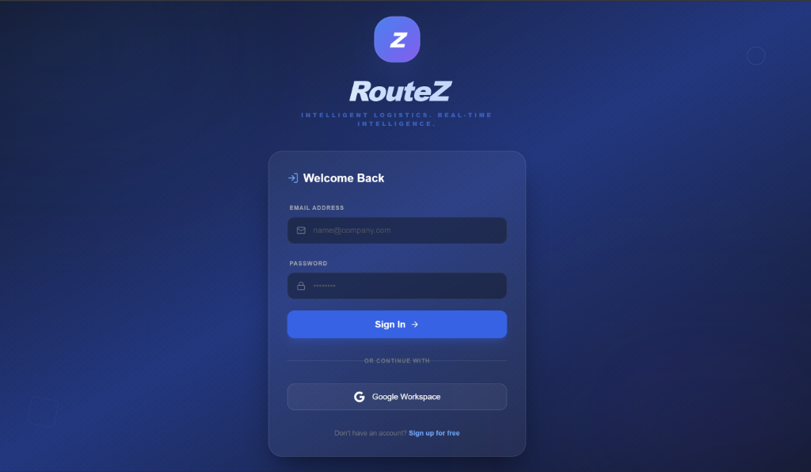

# 🛰️ RouteZ: Intelligent Logistics Command Center

**Intelligent Logistics. Real-time Intelligence.**





RouteZ is a premium, high-fidelity logistics intelligence platform designed to revolutionize global supply chain management. Built for the modern enterprise, RouteZ combines neural risk analysis, atmospheric telemetry, and high-contrast geospatial visualization into a unified, tactical command center.

---

## 🚀 Vision
In an era of global volatility, static logistics are obsolete. RouteZ transforms raw operational data into actionable strategic intelligence, allowing operators to visualize, predict, and optimize every logistics vector in real-time.

## ✨ Core Features

### 🎮 Phase A — Command Center Hub
*   **Tactical HUD**: A centralized dashboard featuring glowing route vectors and animated mission tracking.
*   **Neural Risk Grid**: Real-time analysis of environmental and logistical risk factors with automated confidence scoring.
*   **KPI Pulse**: Live operational metrics (Throughput, Precision, Risk) with animated trend indicators.

### 📊 Phase B — Analytics & Visual Intelligence
*   **Fleet Balance Matrix**: Multi-dimensional Radar charts visualizing Speed, Safety, and Efficiency.
*   **Temporal Risk Analysis**: Advanced Area charts tracking risk vectors over time with HUD-style tooltips.
*   **Sparkline Telemetry**: Real-time trend sparklines embedded directly within metric cards.

### 🛡️ Phase C — Live Tracking War Room
*   **Geospatial War Room**: Fullscreen, high-contrast map interface with floating HUD detail cards.
*   **Global Event Feed**: A real-time operational ticker tracking fleet-wide disruptions and status updates.
*   **Public Readiness**: A guest-facing tracking portal with an animated "Timeline UI" for transparent asset tracking.

### 📦 Phase D — Premium Shipment Registry
*   **Tactical Card Gallery**: High-fidelity shipment cards featuring integrated mini-map previews.
*   **Registry Purge**: Encrypted registry management with premium interactive modals.
*   **Vector Lock-on**: Deep-dive analysis for specific logistics paths.

### 🤖 AI Mission Assistant
*   **Tactical Bot**: A floating, always-on AI assistant providing strategic insights and real-time operational guidance.

---

## 🛠️ Tech Stack

- **Framework**: Next.js 14 (App Router)
- **Styling**: Tailwind CSS + Vanilla CSS (Tactical Dark HUD Aesthetic)
- **Animations**: Framer Motion (Glassmorphism & Micro-interactions)
- **Database/Auth**: Firebase & Firestore
- **Mapping**: Leaflet.js (Dark-mode geospatial tiles)
- **Data Viz**: Recharts (Custom HUD Tooltips & Radar)
- **Intelligence**: OpenRouteService & OpenWeatherMap APIs

---

## 📥 Installation

1. **Clone the repository**:
   ```bash
   git clone https://github.com/yourusername/RouteZ.git
   ```

2. **Install dependencies**:
   ```bash
   npm install
   ```

3. **Configure Environment Variables**:
   Create a `.env.local` file and add your tactical keys:
   ```env
   NEXT_PUBLIC_FIREBASE_CONFIG={...}
   NEXT_PUBLIC_OPENROUTE_API_KEY=your_key
   NEXT_PUBLIC_WEATHER_API_KEY=your_key
   ```

4. **Launch Dashboard**:
   ```bash
   npm run dev
   ```

---

## 🗺️ Roadmap
- [x] Phase A: Tactical HUD
- [x] Phase B: Analytics Engine
- [x] Phase C: War Room Tracking
- [x] Phase D: Premium Gallery
- [ ] Phase E: Predictive Fleet Simulation (Coming Soon)
- [ ] Phase F: Blockchain Ledger Integration (Coming Soon)

---


**RouteZ — Redefining the Logistics Vector.**
